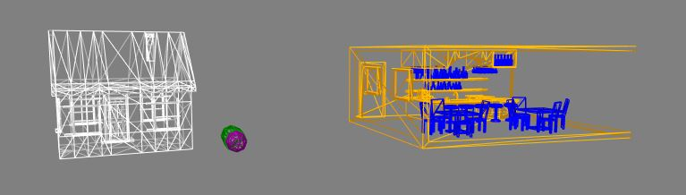

# aframe-materialx-component

**materialx** is a drop-in replacement for the **material** component, which adds the ability to **name** and  **remap** materials.  

If the **remap** is empty (the default), then this material will replace the material of the getObject3D("mesh"), which is the standard mesh geometry used within AFrame.

If the **remap** is *, then this material will replace all materials in all objects associated with this entity.

Any other **remap** will replace all instances of materials with the same name as **remap**. This is useful for
changing specific materials within a model.

Demo at https://harlyq.github.io/aframe-proctree-component/



## Example
```html
<head>
  <script src="https://aframe.io/releases/0.8.2/aframe.min.js"></script>
  <script src="https://unpkg.com/aframe-materialx-component@^0.1.0/aframe-materialx-component.js"></script>
</head>
<body>
  <a-scene>
    <a-entity position="0 0 -5" materialx="remap: Bar_A_mat; color: green; wireframe: true" gltf-model="url(assets/bar/bar.gltf)"></a-entity>
  </a-scene>
</body>
```

## Properties

**name** - defines the name for this material (*string*) default is ""

**remap** - defines the name of an existing material in a geometry to remap to this material (*string*) default is ""
